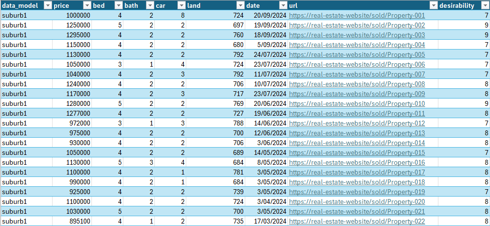

# 🏡 property-price-prediction

Predict property prices using linear regression trained on similar past sales.

This tool helps you estimate property prices based on features such as number of bedrooms, bathrooms, car spaces, land size, and an optional **desirability score** for subjective factors. You can make predictions for current or **future dates**, taking market direction into account.

---

## 📦 Installation

1. **Install [Poetry](https://python-poetry.org/docs/)**  
   Poetry is used for dependency management and packaging.

2. **Install dependencies**  
   In the project root directory, run:

   ```bash
   poetry install
   ```
    You can use another tool such as pip to install the dependencies listed in pyproject.toml
---

## 📁 Data Preparation

You need to spend some manual efforts collecing similar sales. Fill out your collected data in the following spreadsheet:

```
data/similar_sales.xlsx
```


Each row should represent a past sale and include the following columns:

- `data_model` – e.g. the suburb or zone name. This is used to segregate the data into independent models.
- `bed` – number of bedrooms  
- `bath` – number of bathrooms  
- `car` – number of car spaces  
- `land` – land size in square meters  
- `price` – final sale price  
- `date` – sale date in an Excel date format
- `desirability` – *(optional)* subjective score from 1–10 which accounts for intangible qualities like the building condition, street, etc. Set to a constant number eg 7 if you don't want to score.
- `url` – *(optional)* A link to the datasource
- `comments` – *(optional)* Notes about the property


---

## 📊 Making Predictions

You can run predictions via the included Jupyter Notebook:

```
interface.ipynb
```


### Sample prediction input:
Input:

```python
predictor.predict(
    {
        'data_model': 'suburb1',
        'bed': 3,
        'bath': 2,
        'car': 2,
        'land': 750,
        'desirability': 8,
        'date': '2025-04-20'    # Enter as 'YYYY-MM-DD'
    }
)
```
Output:
```
Predicted price for the house with parameters {'data_model': 'suburb1', 'bed': 3, 'bath': 2, 'car': 2, 'land': 750, 'desirability': 8, 'date': '2025-04-20'}:
$1,174,627
```

---
### Sample sensitivity evaluation:
Input:
```python
predictor.get_sensitivities(model_name='suburb1')
```

Output:

    ```
    2025-04-27 10:57:45,629 - INFO - Sensitivities for suburb1:
    2025-04-27 10:57:45,629 - INFO - Impact of ± 1 bedroom: $34,110
    2025-04-27 10:57:45,630 - INFO - Impact of ± 1 bathroom: $63,929
    2025-04-27 10:57:45,630 - INFO - Impact of ± 1 car bay: $-5,355
    2025-04-27 10:57:45,631 - INFO - Impact of ± 100 sqm land: $56,033
    2025-04-27 10:57:45,632 - INFO - Impact of ± 1 month: $9,754
    2025-04-27 10:57:45,632 - INFO - Impact of ± 1 desirability point: $66,572
    ```

## 💡 Contibuting:
If you want to contribute improvements to this, please raise a PR.

---

## 📄 License:
This project is licensed under the [MIT License](LICENSE).
